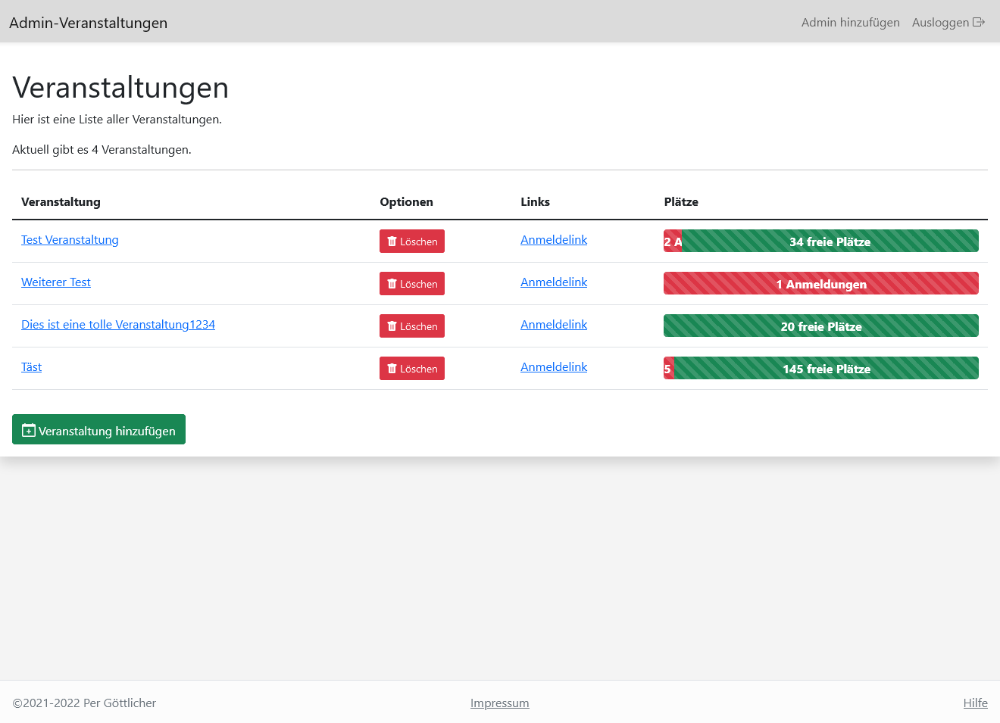
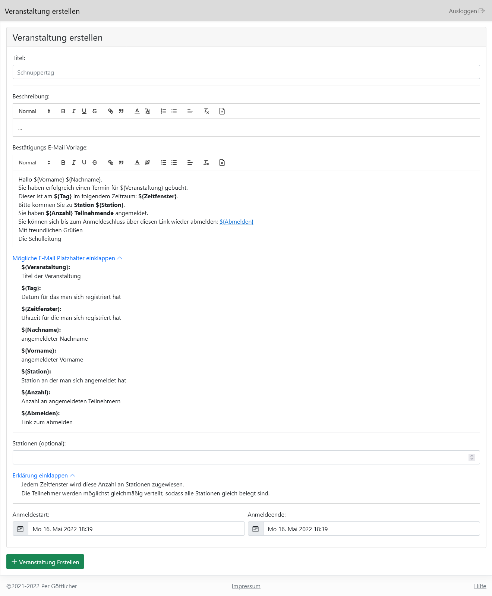
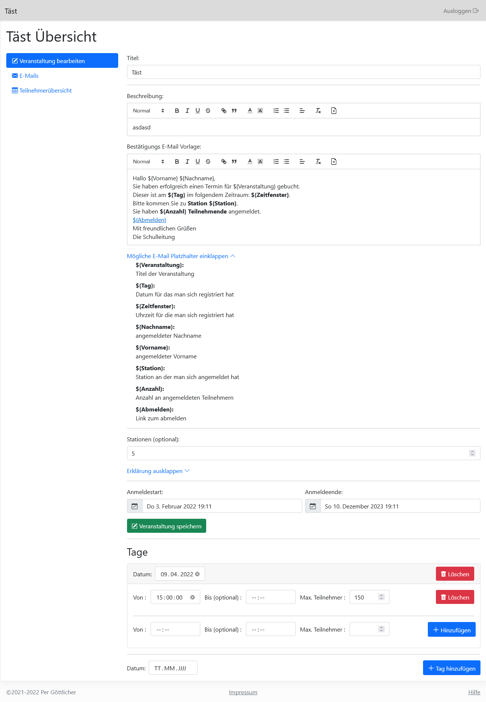
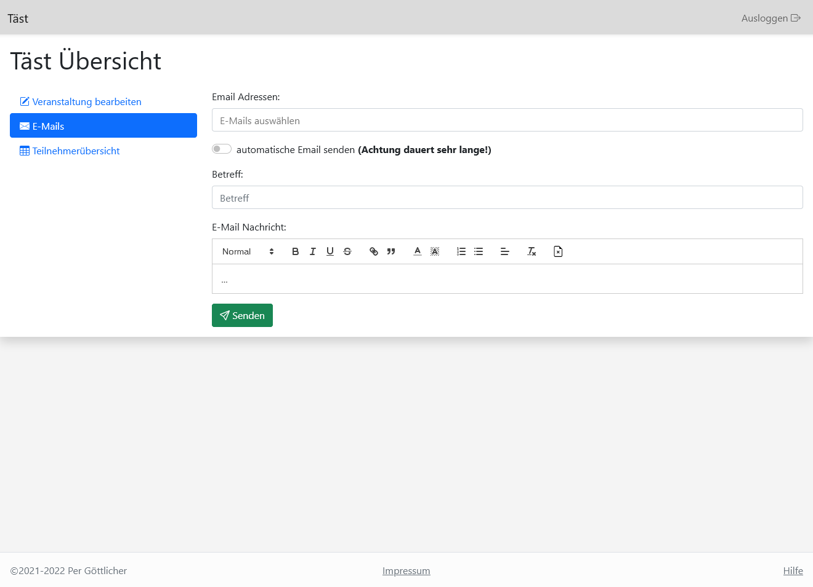
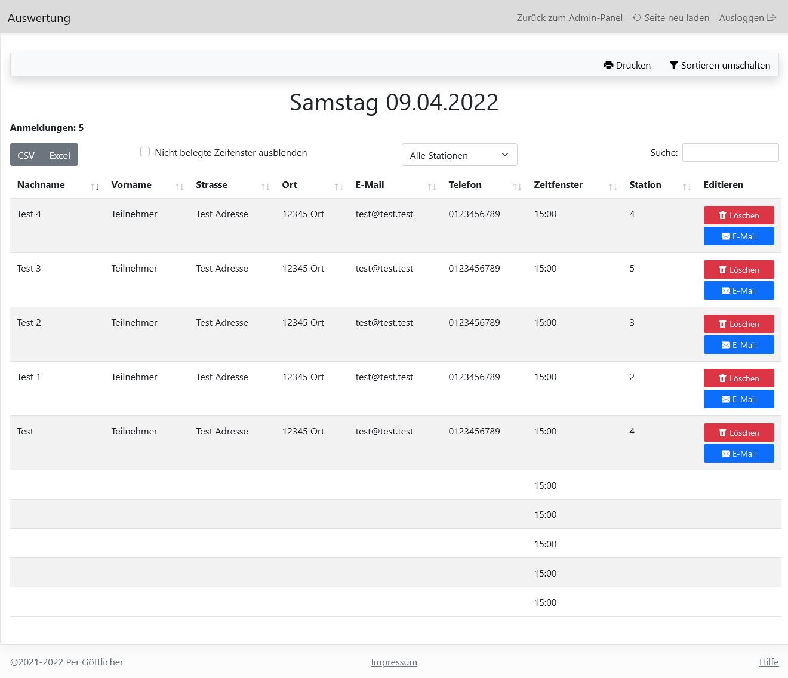

# Eventmanager<!-- omit in toc -->

## Inhalt

- [Inhalt](#inhalt)
- [Beschreibung](#beschreibung)
- [Einrichtung](#einrichtung)
  - [Voraussetzungen](#voraussetzungen)
  - [Konfiguration](#konfiguration)
  - [Installation](#installation)
  - [Sonstige Hinweise](#sonstige-hinweise)
- [Bedienung](#bedienung)
  - [Veranstaltungen erstellen](#veranstaltungen-erstellen)
  - [Veranstaltungen bearbeiten](#veranstaltungen-bearbeiten)
    - [E-Mails Tab](#e-mails-tab)
  - [Teilnehmerübersicht](#teilnehmerübersicht)
- [Lizenz](#lizenz)

## Beschreibung

Mit diesem Tool kann man Anmeldungen für Veranstaltungen verwalten.

Dieses Tool wurde für eine Schule entwickelt.

## Einrichtung

### Voraussetzungen

``PHP >= 7.4 <= 8.1``

### Konfiguration

1. `example.config.ini` kopieren und in `config.ini` umbenennen.
2. Datenbankverbindung konfigurieren
3. E-Mail Server konfigurieren
4. Pfad zum Eventmanager angeben z.B. `/anmelden`
5. URL zum Impressum einfügen

### Installation

1. [Konfiguration](#konfiguration) abschließen
2. `admin/install.php` aufrufen, dieses Skript erstellt automatisch alle nötigen Datenbanktabellen und generiert ein neues Secret falls noch kein ausreichend langes definiert wurde.
3. `admin/add_admin.php` aufrufen (Sie sollten automatisch hierhin weitergeleitet werden) und einen Admin-Account anlegen. **Solange kein Account erstellt wurde ist dieses Skript ohne Anmeldung erreichbar.**
4. Die Einrichtung ist abgeschlossen und Sie können sich unter `admin/` anmelden und die erste Veranstaltung erstellen!

### Sonstige Hinweise

- Secret neu erstellen: Sollten Sie ein neues Secret erstellen wollen, einfach `secret` in der `config.ini` entweder leerlassen oder kürzer als 32 Zeichen setzen und `admin/install.php` erneut aufrufen. Nun wurde ein neues Secret generiert. **Alle alten Passwörter werden dadurch ungültig, Sie müssen sofort ihr Passwort ändern, ansonsten verlieren Sie den Zugriff auf ihren Account.**

## Bedienung

Als erstes die [Einrichtung](#einrichtung) beenden.

Nun können Sie im Admin-Panel (`<Pfad zum Tool>/admin/`) eine Übersicht aller Veranstaltungen sehen und neue Veranstaltungen hinzufügen.

In der ersten Spalte sind alle Veranstaltungen aufgelistet ein klickt auf den Namen bringt Sie zur [Bearbeitungsseite](#veranstaltungen-bearbeiten).

Die zweite Spalte gibt ihnen die Möglichkeit die Veranstaltung zu löschen.

In der dritten Spalte ist ein direkter Link zur Anmeldung für die jeweilige Veranstaltung.

Als letztes sieht man die Anzahl der Anmeldung, bei einem Klick auf die Statusleiste wird man direkt zur Teilnehmerübersicht geleitet.

### Veranstaltungen erstellen

Auf dieser Seite können Sie eine neue Veranstaltung erstellen, die Veranstaltungstage werden erst später eingefügt.

In der Bestätigungs-E-Mail können verschiedene Platzhalter eingebaut werden, diese werden beim versenden der E-mail durch die entsprechenden Werte ersetzt.

Wenn Sie die Veranstaltung erfolgreich erstellt haben werden Sie auf die Admin Seite zum bearbeiten der Veranstaltung weitergeleitet, dort können Sie der Veranstaltung Tage hinzufügen.

### Veranstaltungen bearbeiten

Auf dieser Seite können Sie alle Einstellungen der Veranstaltung nochmal bearbeiten und auch die Tage und Zeitfenster hinzufügen.

**Achtung Sie müssen Änderungen an der Veranstaltung mit "Veranstaltung speichern" bestätigen, während alle Änderungen an Tagen automatisch ausgeführt werden.**

#### E-Mails Tab

In diesem Tab können Sie an bestimmte oder alle Teilnehmer eine E-Mail senden oder die automatische E-Mail erneut senden.

### Teilnehmerübersicht

Auf dieser Seite können Sie alle Teilnehmer sehen.
Wenn sie nach mehreren Spalten gleichzeitig sortieren wollen müssen Sie <kbd>Shift</kbd> + <kbd>Klick</kbd> nutzen.

## Lizenz

Copyright (c) 2022 - present Per Göttlicher

Diese Software wird unter der [GPL v3 Lizenz](https://www.gnu.org/licenses/gpl-3.0.en.html) vertrieben.
